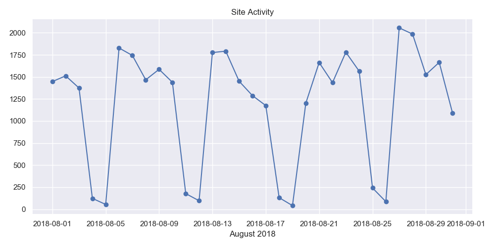
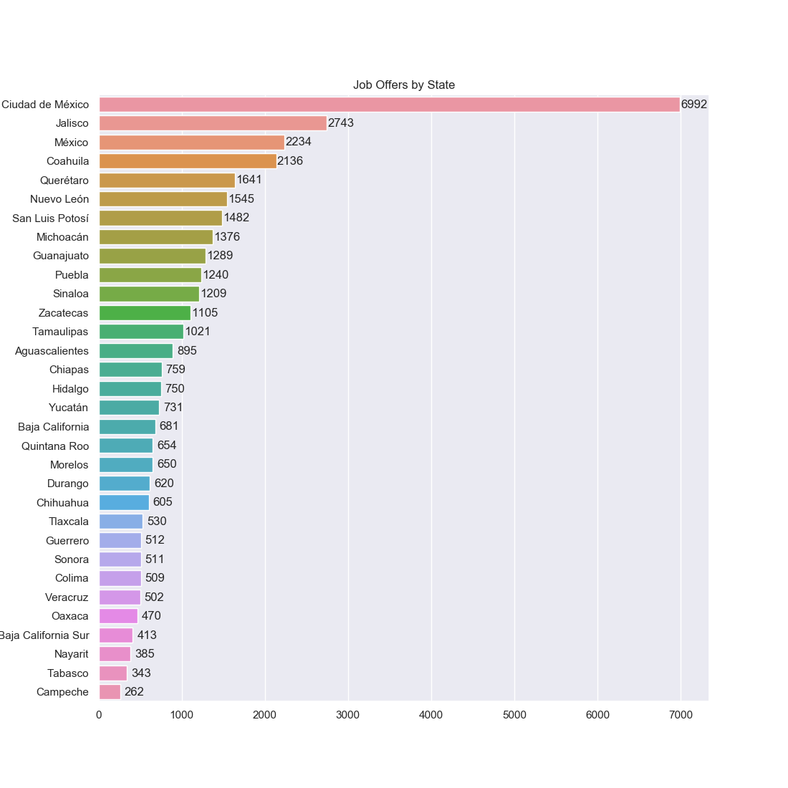
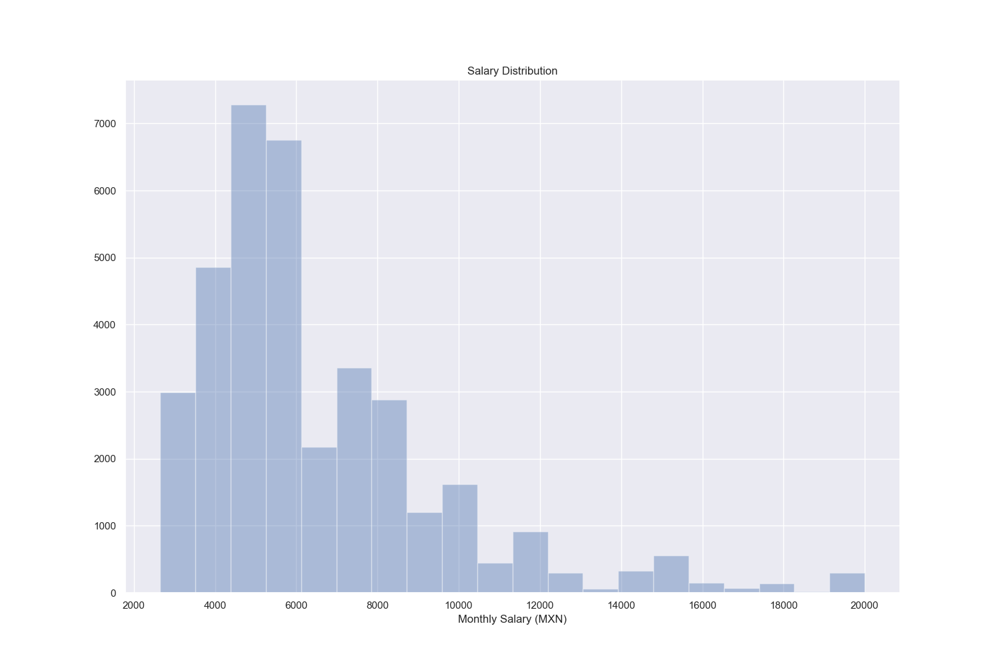
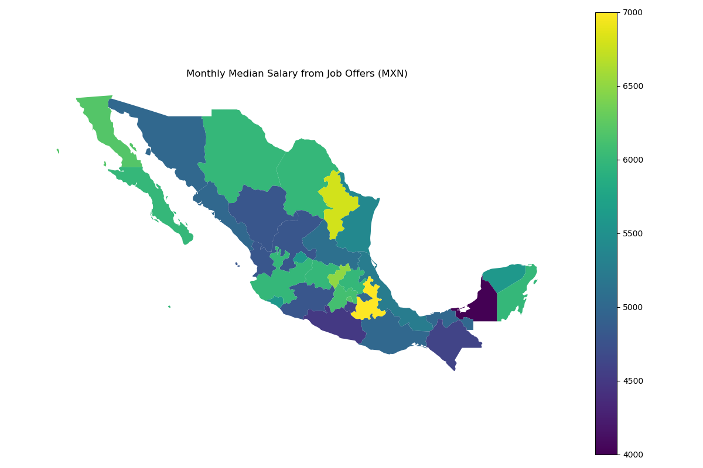
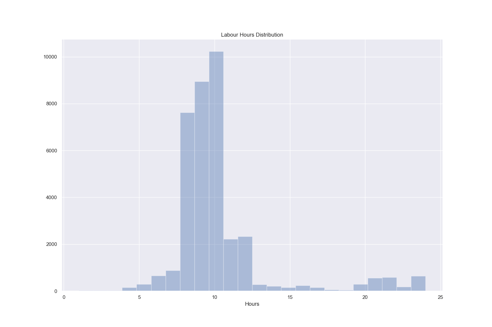
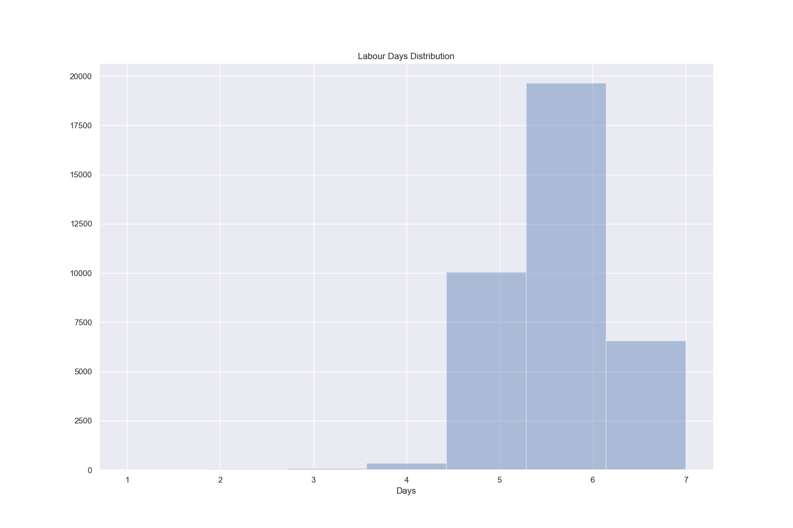
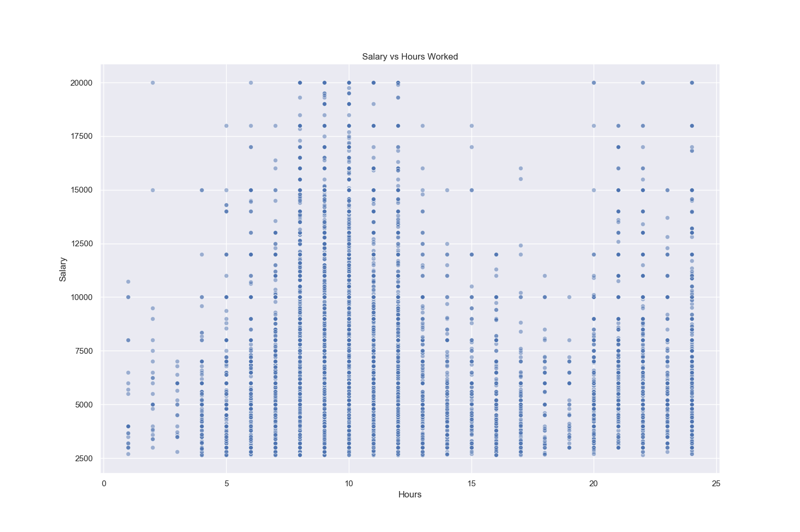

# Mexican Jobs

This project contains several scripts used for the analysis of job listings posted in the official Mexican Job Board (https://www.empleos.gob.mx).

A secondary use for this project was the creation of 2 Reddit bots that help users to quickly filter job listings with their desired parameters, including salary range, location and a keyword.

## Scripts

Name | Brief Description
--|--
`scraper.py` | A web scraper made with `Requests` and `BeautifulSoup` that continously keeps saving new job listings.
`post_bot.py` | A Reddit bot made with `PRAW` and `lxml` that creates a digest with the highest paying jobs country wide.
`comments_bot.py` | A Reddit bot made with `PRAW` and `lxml` that creates a customized digest with the parameters given by the user.
`step2.py` | An utility script that extracts and computes the required data from the job listings files, once computed it saves all the data to a .csv file.
`step3.py` | A collection of functions to extract insights and generate plots from the dataset, it uses `Matplotlib`, `Pandas`, `Seaborn`, `GeoPandas` and `NumPy`.

All of these scripts were written in Python 3, some were deployed on a VPS and were scheduled with the following crontab.

```
*/5 * * * * cd /home/scripts/ && python3 scraper.py
15,30,45,0 cd /home/scripts/ && python3 post_bot.py
* * * * * cd /home/scripts/ && python3 comments_bot.py
```

### Web Scraper

Creating the web scraper required to study the structure of the website. Searching for job listings can be achieved with only `GET` requests. Not providing any keyword returns all the available jobs for the desired state.

All states urls were hardcoded and added to a list. The script iterates over this list and requests the contents of each state.

The script detects if the available job listings are not already saved and if there are new job listings it saves them to their respective state folders and updates a log file with the current timestamp.

This is run every 5 minutes to ensure that almost all job listings are saved and to avoid making too many requests to the server.

While debugging this script I noticed that I constantly got timed out from the server. I was able to fix this by reusing a Session object while making all requests and also adding a retry capability.

### Reddit Bots

Both Reddit bots share most of their functionality. They first load the log file created by the web scraper and discard all items that are older than 3 days.

With the remaining items it uses multithreading and `lxml` to quickly extract the relevant data from the .html files and adds it to a master list as tuples. The master list is then sorted by the salary value.

After the master list is sorted, the script starts creating the `Markdown` message that will be posted on Reddit.

The `post_bot.py` script only grabs the highest paying jobs and keeps concatenating them to the message string until it reaches 39,000 characters.

Reddit has a 40,000 character limit on posts. The ramaining 1000 characters are used for the footer where I added some links and the timestamp.

The `comments_bot.py` script is much more complex than the previous one. After the master list is sorted it then connects to the Reddit API and checks for new comments with the `!empleos` command.

The `!empleos` command can have up to 4 parameters.

Parameter | Required or Optional | Type
--|--|--
Location | Required | 1 String
Minimum Salary | Optional | Integer
Maximum Salary | Optional | Integer
Keyword | Optional | 1 String

The script splits the message body and verifies each of the parameters to be the correct type, cleans them and adds them to a dictionary.

This dictionary is then sent to a function where the values are compared against the values of the master list.

In this new function we start a counter and for each job listing that fulfills our parameters we increase it by 1.

The first check is the location, if the provided location isn't available in the master list, it is then instantly discarded.

If the script detects that a minimum salary was provided it then discards all jobs where the salary is lower than the one specified.

Similar rules apply for the other 2 parameters. Once our counter hits 10 we stop filtering job listings, this is due to Reddit's comment limit of 10,000 characters.

Finally we add the footer to the message and reply to the original comment.

## Analysis

A total of 36,795 job offers were collected, analyzed and processed. These offers were posted from all Mexico states and every day of the month. Let's start by observing the website activity.


### Monthly Activity

The next figure illustrates the amount of job offers posted by day on the month of August.



In Mexico, the week starts on Monday. As shown in the figure, Mondays and Tuesdays are the days with the most activity and the weekends have the lowest.

In the next figure we can observe the distribution of job offers by state.



Ciudad de México had the largest representation, more than double of the next one, this can be explained by it being the capital of the country, having a high population density and being the biggest commerce hub. It is very common for people from nearby states to work there.

Jalisco, Mexico State, Coahuila and Queretaro are next on the list, they are known for various industries, including clothing, cars and aerospace manufacturing.

### Monthly Salaries

At the time of this writting, the minimum monthly salary was 2,686 MXN which equals to 142.65 USD.

| Key | Amount in MXN | 
| --- |:------|
| Mean | 6,816
| Median | 6,000
| Std | 4,638
| Min | 2,650
| Max | 164,949
| 25% | 4,500
| 50% | 6,000
| 75% | 8,000

It is interesting that the mean doesn't differ too much from the median salary. The outliers were not enough to considerably skew the mean.

In the following figure we can observe the distribution of salaries. I only took into account salaries between the minimum wage and 20,000 MXN which represents the 99% of all salaries.




The most common salaries were 6,000 (10.46%), 5,000 (7.68%), 4,000 (6.91%), 8,000 (6.18%), 7,000 (5.11%) and 10,000 (4.1%).

| Percent | Salary Range in MXN | 
| ---:|:------|
| 18.7% | < 4,000
| 40.5% | 4,001 to 6,000
| 21.7% | 6,001 to 8,000
| 9.1% | 8001 to 10,000
| 7.2% | 10,001 to 15,000
| 2.9% | > 15,000

It is often put on debate how many oeople actually earn the minimum wage. These job offers tells us that at least 81.3% of employers are willing to pay 4,000 MXN or more.

A heat map was plotted to showcase the median salary by state



The median salary gets higher on northern states, particularly on those that are close to the U.S border, it is also higher on the center of the country, where Ciudad de Mexico, Mexico State and Puebla are located.

The lowest median salaries are located in the south of the country. Campeche scored the lowest in both median salary and number of job offers which may have skewed the results on this particular state.

It is important to note that the cost of living is higher on northern and centric states and gets lower in the southern states. Most of the southern states economy is based on tourism, retail and agriculture compared to manufacturing on the northern states.

### Labour Hours and Days

The job listings provided the start and end hours for each job offer. In the next figure we can observe how the labor hours are distributed.



The most common labour hours were 10 (27.8%), 9 (24.3%), 8 (20.7%), 11 (6.3%) and 12 (6%) which represent 85.1% of the total distribution.



The most common labour days were 6 (53.4%), 5 (27.2%) and 7 (17.8%) which represent 98.4% of the total distribution.

Both histograms tells us that these job offers are requiring that employees work the most hours and days. But we need to know if the remuneration is proportial to the time worked.



Jobs between 8 and 12 hours have the more ocurrences of higher salary. The jobs between 21 and 24 hours also have significant higher saleries, one explanation would be that their salaries are paid hourly instead of daily.

### Conclusion

What motivated me to start this project was to know what are the most common salaries In Mexico, it is often discussed how much people earn in their professions.

But we mostly hear from people that earn way above the median and from people that earn the lowest which causes bias and misinformation.

The website empleos.gob.mx doesn't offer the best paying jobs but the amount of data collected was good enough to get a general idea of the current salaries.

It would be interesting to run this project yearly to also know if the salaries catch up with inflation.

Feel free to make your own plots and insights from the dataset, it is located in the [data](./data) folder in .csv format.

Also feel free to suggest edits or enhancements.